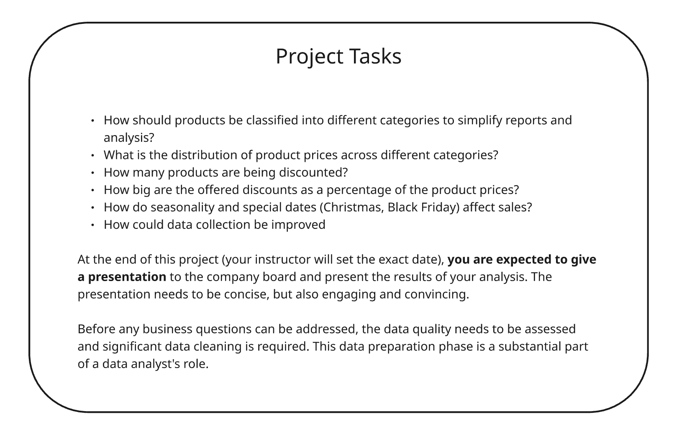
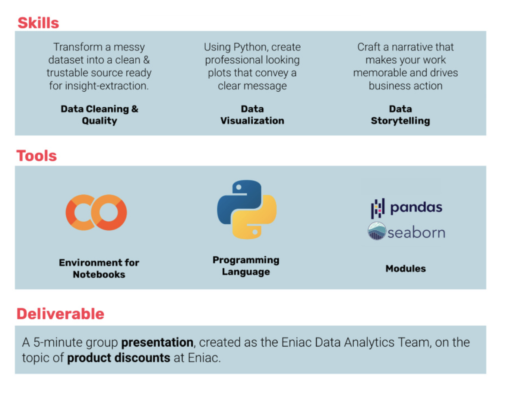

# Case-Study-Eniac-Discounts
## DataScience Project 2 : WBS Coding School
This project is part of my studies in Data Science Course covering topics like Data Cleaning, Data Quality, Data Analysis and Data Visualization.

## Objective: 
To find that whether or not it’s beneficial to discount products.

Details of this project are as follows:

## Case-Study-Eniac-Discounts
We will keep working for Eniac —the e-commerce tech company— as a Data Analyst. This time you will work with internal data, which is not anonymised… but a bit more chaotic! The complexity of these tasks will require you to use Python, rather than SQL.

The company has high hopes put into the possibilities that come with Data Analysis, and they are especially hopeful that your work can finally settle an ongoing debate: whether or not it’s beneficial to discount products.

-> The Marketing Team Lead is convinced that offering discounts is beneficial in the long run. She believes discounts improve customer acquisition, satisfaction and retention, and allow the company to grow.
-> The main investors in the Board are worried about offering aggressive discounts. They have pointed out how the company’s recent quarterly results showed an increase in orders placed, but a decrease in the total revenue. They prefer that the company positions itself in the quality segment, rather than competing to offer the lowest prices in the market.

## Business Questions

So, to guide **Eniac** with these 2 aspects, we have gathered some data from Magist & showcased the insights which will be helpful for Eniac to decide.

## Project Overview

## Key Learnings:
1. Data Cleaning.
2. Data quality.
3. Data Analysis and solutions.
4. Story Telling.
5. Data Visaualizyation.
6. Present the findings with recommendation.

## Approach
The p:

Our approach to solving the problem is 4-step: 

1- Cleaning the data.

2- Improving the data quality.

3- Data analysis and solutions.

4- Visualizing the data and preparing our recommendation for presentation.

## Conclusion:
We have concluded our presentation as:

We support the board of investors' decision to avoid frequent, aggressive discounts. Our data indicates that such discounts rarely boost sales and often lead to lower revenue. Instead, our company's strength lies in direct customer contact, which builds higher retention and growth through quality, not low prices.

**We recommend to avoid frequent, aggressive discounts.**

